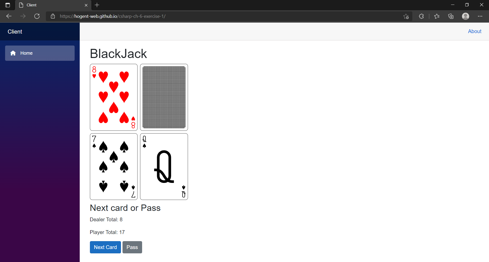
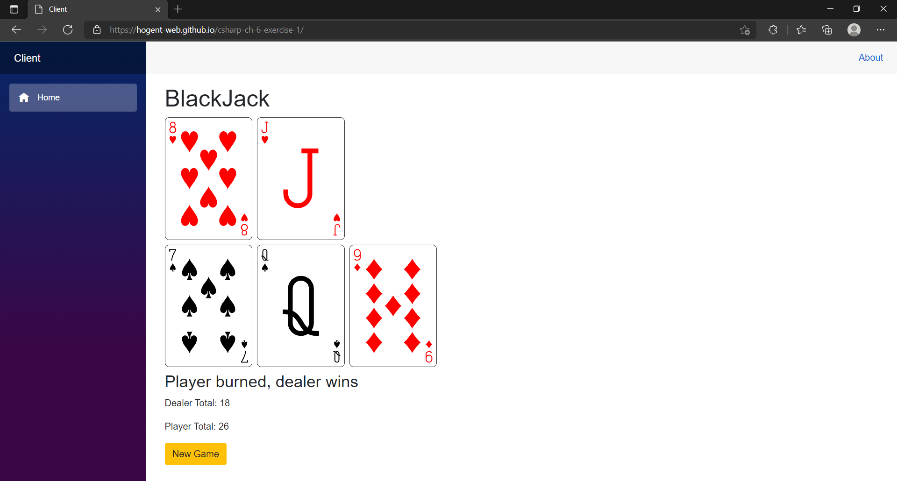
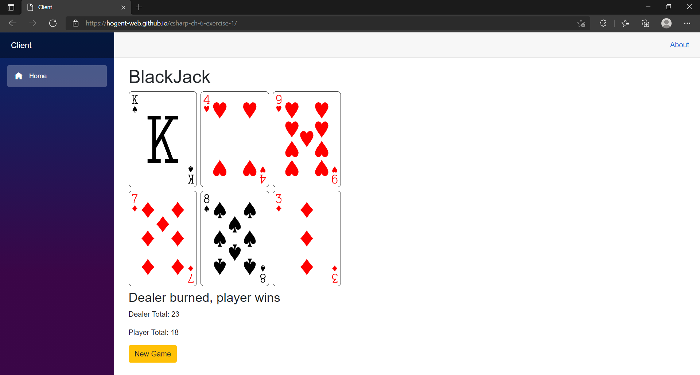
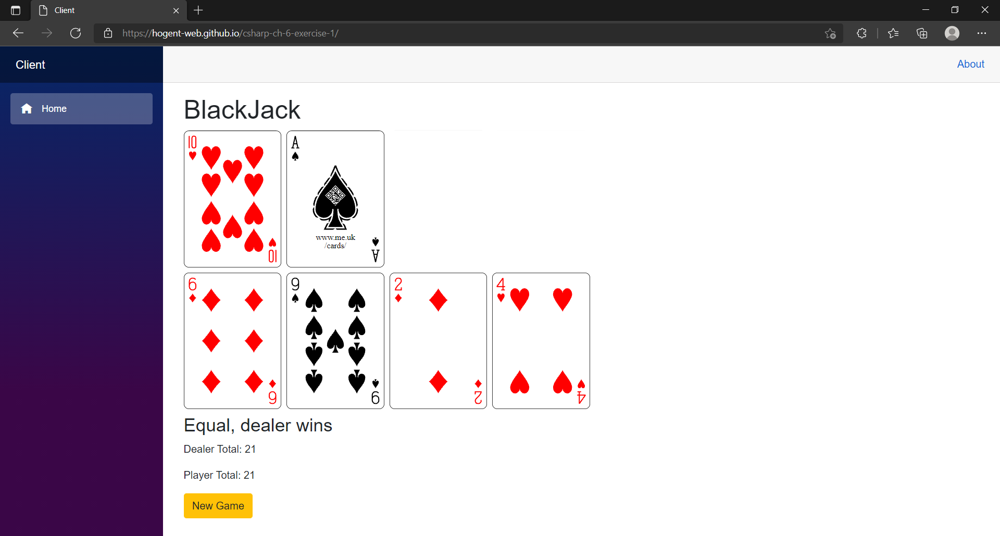
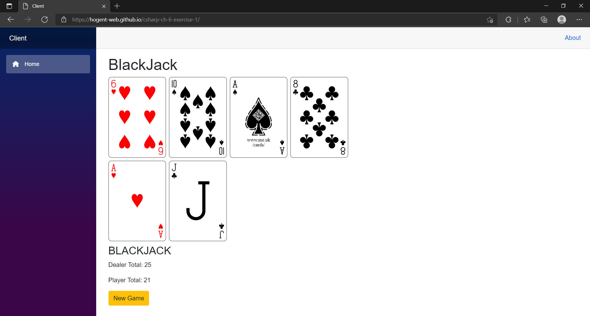

# Chapter 1 - Exercise 1
##  Objectives
- Learn how to create a Blazor Web Assmebly Application
- Learn how to create a component
- Learn how to use components with parameters
- Learn how to use event handlers
- Learn how to deploy a static Blazor Web Assembly App to GitHub Pages

## Goal 
In this exercise we are going to take the BlackJack game to the next level. Where we used to use a console application, we will now use a Blazor Web Assembly app.

A live version of what you'll be creating can be found [here](https://hogent-web.github.io/csharp-ch-6-exercise-1/), what follows are screenshots of the different game states.

### Start Game

### Player Burned, Dealer Wins

> Player has passed - his score 18, dealer automatically continues playing until he has an equal or higher score than player (in this case 19, 20 or 21). He reaches 23 and the player wins. Buttonto start a new game will be visible. Next Card and Pass buttons are not visible.> Player has asked for (and re
ceived) a card - his score exceeds 21 and dealer wins. Button to start new game becomes visible. Card and Pass buttons are not visible.

### Dealer Burned, Player Wins

> Player has passed - his score is 18, the dealer automatically continues playing until he has an equal or higher score than player (in this case 19, 20 or 21). He reaches 23 and the player wins. Button to start a new game will be visible. Next Card and Pass buttons are not visible.

### Equal, dealer wins

> If the score is equal, the dealer wins.

### Equal, dealer wins

> Player has a score of 21.

## Exercise
- Clone this repository's `main` branch
- The solution already contains the following:
    - Blazor WASM Client
    - Domain (which did not change since the console application)
- In the Client/Pages/Index.razor implement the following:
    - Create a new instance of the BlackJack game
    - Use the methods of the BlackJack object to render:
        - The dealer cards - `DealerHand.Cards` 
        - the player cards - `PlayerHand.Cards`
        - the game summary - `GameSummary`
        - the action buttons:
            - new game - `create a new instance of BlackJack`
            - next card - `GivePlayerAnotherCard`
            - pass - `PassToDealer`
        > Tip: first try to render the cards without images.
- Rendering cards:
    - Create a new folder `Components` in the Client project.
    - Create a new component called `Card`
    - All images of the cards are available in the `images` folder of the `wwwroot` in `.svg` format
        - `.svg` can be rendered in a `` tag.
        - conventation of the cards to render:
            - 1C  : Ace of Clovers
            - 11H : Jack of Hearts 
            - 13S : King of Spades 
            - 10D : Ten of Diamonds 
            - BACK: Face of the card is upside down.
            > Tip: Use `Enum.GetName()` and casting to `(int)` to render the correct image.
- Deploy your app to GitHub Pages using the [instructions in the slides](https://hogent-web.github.io/csharp/chapters/06/slides/index.html#deployment)

## Solution
A possible solution can be found [here](https://github.com/HOGENT-Web/csharp-ch-6-exercise-1/tree/solution#solution).# BlackJackBlazor
